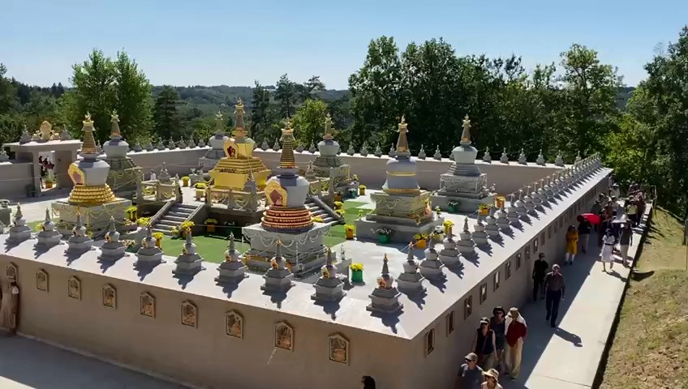

<video id="background-video" preload="none" playsinline autoplay muted loop poster="./featured.jpg">
    <source src="/background.webm" type="video/webm">
    <source src="/background.mp4" type="video/mp4">
    <object data="" type="">
      
    </object>
</video>

##  Origins

The Chanteloube stupa was built in 1992. During the construction process, the most precious relics and substances were placed inside. Once it was completed, several great lamas came to consecrate the stupa, including Kyabje Trulshik Rinpoche, Sakya Trizin Rinpoche, Dzongsar Khyentse Rinpoche, and Tenga Rinpoche. 

With the intent of promoting peace in the world and with the help of friends and patrons, in the spring of 2005 the entire stupa was covered with gold-leaf. 

##  What is a stupa ? 

A stupa promotes peace and harmony by purifying and subduing negative forces. In the Buddhist tradition, it is believed that the construction of stupas, with the sacred vases and other precious materials and relics placed within them, has the power to restore the earth’s energies and to help balance the elements. In this way, the construction of stupas helps to prevent natural disasters, wars, famine, and diseases and they help to balance the natural forces that promote health, prosperity and well being.It is said that developing a positive attitude and praying for the peace and happiness of all sentient beings in the presence of such a sacred object can help to extend one’s life and to pacify sickness. 

Visiting and venerating stupas, e.g. by circumambulating them in a clockwise direction, also ripens one’s potential to attain enlightenment. They create a peaceful environment and inspire well-being and joy for the whole region in which they are built. 

##  Guidelines for visiting the stupa 

Visitors are welcome to circumambulate the stupa at Chanteloube. Although the three-year retreat structure nearby is completely enclosed, it is still very near in proximity to the stupa. Therefore, all visitors are requested to abide by the following guidelines : 

* Please leave you cars at the first, upper car park (just before the no entrance signs) and proceed to the stupa on foot.
* Please do not approach the buildings on the left of the path and the stupa (in the South-Eastern quadrant), which are closed to the public during the three-year retreat period.
* Please be mindful of preserving the tranquillity and peacefulness of the environment (speak very quietly, keep your dog on a leash, and do not smoke)
